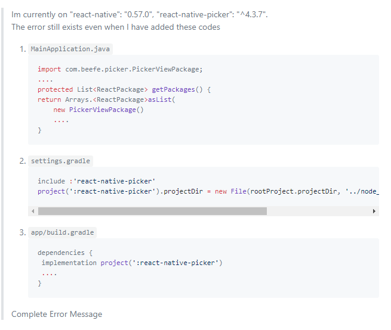

记录开发过程中遇到的问题

### 安装 **[react-native-picker](https://github.com/beefe/react-native-picker)**一直失败

1. 如果使用的windows系统，请使用管理员权限运行命令

2. 安卓配置中缺少部分配置：

   参考：

    https://github.com/beefe/react-native-picker/issues/340 

    https://github.com/beefe/react-native-picker/issues/121 

3. 

###  如何理解组件里面的普通函数和箭头函数